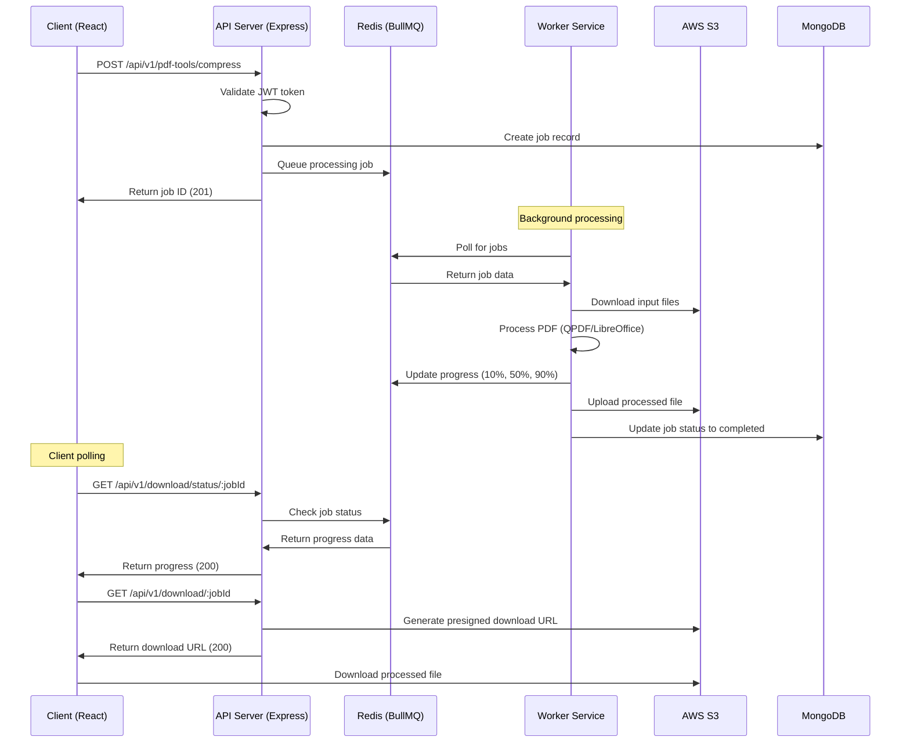

# FileMaster Technical Documentation

## Table of Contents
1. [System Architecture](#1-system-architecture)
2. [Technology Stack Deep Dive](#2-technology-stack-deep-dive)
3. [Data Models (Database Schema)](#3-data-models-database-schema)
4. [API Specification](#4-api-specification)
5. [Detailed Processing Workflow](#5-detailed-processing-workflow)
6. [Security Architecture](#6-security-architecture)
7. [Environment & Configuration](#7-environment--configuration)

---

## 1. System Architecture

### Microservices Architecture Overview

FileMaster follows a microservices architecture with three primary services:

- **Client Application**: React-based frontend with Vite build system
- **API Server**: Express.js REST API with JWT authentication
- **Worker Service**: Background job processor for PDF operations

### Supporting Infrastructure

- **Database**: MongoDB for user data and job management
- **Cache**: Redis for job queues, rate-limiting, and session data
- **Storage**: AWS S3 for file storage and processing
- **Containerization**: Docker for service isolation and deployment

### Data Flow and Request Processing

During a typical PDF processing job, the following flow occurs:

1. **Client Request**: User initiates PDF operation through React frontend
2. **Authentication**: API server validates JWT token and user permissions
3. **File Upload**: Client uploads files to S3 using presigned URLs
4. **Job Creation**: API server creates job record in MongoDB and queues job in Redis
5. **Worker Processing**: Background worker picks up job and processes files
6. **Progress Updates**: Worker updates job status in Redis cache
7. **Client Polling**: Client polls API server for real-time progress updates
8. **Result Storage**: Worker stores processed files in S3
9. **Download**: Client downloads processed files from S3

### System Architecture Sequence Diagram



---

## 2. Technology Stack Deep Dive

### Frontend Technologies

#### React 19.1.0
- **Role**: Core frontend framework for building user interface
- **Implementation**: Functional components with hooks for state management
- **Key Features**: PDF preview using PDF.js, responsive design with Ant Design

#### Redux Toolkit
- **Role**: State management for complex application state
- **Implementation**: Manages user authentication, job status, and UI state
- **Key Features**: Centralized store with reducers for different app modules

#### Ant Design
- **Role**: UI component library for consistent design system
- **Implementation**: Forms, modals, progress indicators, and layout components
- **Key Features**: Pre-built components for file upload, progress tracking, and user interface

#### Vite
- **Role**: Build tool and development server
- **Implementation**: Fast development server with hot module replacement
- **Key Features**: Optimized production builds, TypeScript support, plugin ecosystem

### Backend Technologies

#### Node.js 20
- **Role**: JavaScript runtime for server-side application
- **Implementation**: Handles HTTP requests, file processing, and database operations
- **Key Features**: Event-driven architecture, non-blocking I/O, npm ecosystem

#### Express.js
- **Role**: Web application framework for REST API
- **Implementation**: Route handling, middleware integration, request/response processing
- **Key Features**: Middleware support, routing, template engines, error handling

#### MongoDB with Mongoose
- **Role**: NoSQL database for user data and job management
- **Implementation**: Document-based storage with Mongoose ODM for schema validation
- **Key Features**: Flexible schema, horizontal scaling, rich query language

#### Redis with BullMQ
- **Role**: In-memory data store for caching and job queues
- **Implementation**: Job queue management, session storage, rate limiting
- **Key Features**: High performance, data persistence, pub/sub messaging

### PDF Processing Technologies

#### PDF-lib
- **Role**: JavaScript library for PDF manipulation
- **Implementation**: Client-side PDF operations and preview functionality
- **Key Features**: PDF creation, modification, form filling, digital signatures

#### QPDF
- **Role**: Command-line PDF toolkit for server-side processing
- **Implementation**: Secure process spawning for PDF compression and manipulation
- **Key Features**: Linearization, object stream generation, compression

#### LibreOffice
- **Role**: Document conversion engine
- **Implementation**: Headless LibreOffice for converting documents to/from PDF
- **Key Features**: Multi-format support, batch processing, command-line interface

#### Poppler Utilities
- **Role**: PDF rendering and manipulation utilities
- **Implementation**: PDF rendering for previews and metadata extraction
- **Key Features**: PDF to image conversion, text extraction, metadata reading

### Infrastructure Technologies

#### Docker
- **Role**: Containerization platform for service isolation
- **Implementation**: Separate containers for API server and worker processes
- **Key Features**: Process isolation, resource limits, consistent deployment

#### AWS S3
- **Role**: Cloud storage for file upload and download
- **Implementation**: Presigned URLs for secure file transfer
- **Key Features**: Scalable storage, CDN integration, access control

#### Nginx
- **Role**: Reverse proxy and load balancer
- **Implementation**: Routes requests to appropriate services
- **Key Features**: Load balancing, SSL termination, static file serving

---

## 3. Data Models (Database Schema)

### User Collection

The User collection stores user authentication and profile information.

| Field | Type | Required | Unique | Description | Validation Rules |
|-------|------|----------|--------|-------------|------------------|
| `_id` | ObjectId | Yes | Yes | Primary key | Auto-generated |
| `email` | String | Yes | Yes | User email address | Valid email format |
| `fullName` | String | Yes | No | User's full name | Min 2, Max 100 characters |
| `password` | String | Yes | No | Hashed password | bcrypt hashed, min 8 characters |
| `loginType` | Array | Yes | No | Authentication methods | ["email", "google"] |
| `refreshToken` | String | No | No | JWT refresh token | JWT format |
| `createdAt` | Date | Yes | No | Account creation timestamp | Auto-generated |
| `updatedAt` | Date | Yes | No | Last update timestamp | Auto-updated |

**Relationships:**
- One-to-many with Job collection via `userId` field

### Job Collection

The Job collection tracks PDF processing jobs and their status.

| Field | Type | Required | Unique | Description | Validation Rules |
|-------|------|----------|--------|-------------|------------------|
| `_id` | ObjectId | Yes | Yes | Primary key | Auto-generated |
| `jobId` | String | Yes | Yes | Unique job identifier | UUID format |
| `userId` | ObjectId | Yes | No | Reference to User | Valid ObjectId |
| `operation` | String | Yes | No | PDF operation type | Enum: merge, split, compress, etc. |
| `status` | String | Yes | No | Job processing status | Enum: pending, processing, completed, failed |
| `progress` | Number | Yes | No | Processing progress percentage | 0-100 range |
| `inputFiles` | Array | Yes | No | S3 keys of input files | Array of strings |
| `outputFile` | String | No | No | S3 key of output file | String format |
| `createdAt` | Date | Yes | No | Job creation timestamp | Auto-generated |
| `updatedAt` | Date | Yes | No | Last update timestamp | Auto-updated |

**Relationships:**
- Many-to-one with User collection via `userId` field

### Indexes

**User Collection:**
- `email` (unique index)
- `refreshToken` (sparse index)

**Job Collection:**
- `jobId` (unique index)
- `userId` (index for user queries)
- `status` (index for status queries)
- `createdAt` (index for time-based queries)

---

## 4. API Specification

### Authentication Endpoints

#### POST /api/v1/users/register-email
**Description**: Register a new user with email address

**Headers:**
```
Content-Type: application/json
```

**Request Body:**
```json
{
  "email": "user@example.com"
}
```

**Success Response (201):**
```json
{
  "success": true,
  "statusCode": 201,
  "message": "Registration email sent successfully",
  "data": {
    "email": "user@example.com",
    "verificationRequired": true
  }
}
```

**Error Status Codes:**
- `400` - Invalid email format
- `409` - Email already exists
- `429` - Rate limit exceeded

#### POST /api/v1/users/login
**Description**: Authenticate user and return JWT tokens

**Headers:**
```
Content-Type: application/json
```

**Request Body:**
```json
{
  "email": "user@example.com",
  "password": "password123"
}
```

**Success Response (200):**
```json
{
  "success": true,
  "statusCode": 200,
  "message": "User logged in successfully",
  "data": {
    "loggedInUser": {
      "_id": "64a1b2c3d4e5f6789abcdef0",
      "email": "user@example.com",
      "fullName": "John Doe"
    },
    "accessToken": "eyJhbGciOiJIUzI1NiIsInR5cCI6IkpXVCJ9...",
    "refreshToken": "eyJhbGciOiJIUzI1NiIsInR5cCI6IkpXVCJ9..."
  }
}
```

**Error Status Codes:**
- `400` - Invalid request data
- `401` - Invalid credentials
- `429` - Rate limit exceeded

### PDF Operations Endpoints

#### POST /api/v1/pdf-tools/compress
**Description**: Compress a PDF file to reduce file size

**Headers:**
```
Content-Type: application/json
Authorization: Bearer <access_token>
X-CSRF-Token: <csrf_token>
```

**Request Body:**
```json
{
  "s3Key": "uploads/user123/file.pdf",
  "compressionLevel": "ebook",
  "originalFileName": "document.pdf"
}
```

**Success Response (200):**
```json
{
  "success": true,
  "statusCode": 200,
  "message": "PDF compression job queued successfully",
  "data": {
    "jobId": "550e8400-e29b-41d4-a716-446655440000",
    "message": "Your PDF compression job has been queued",
    "statusUrl": "/api/v1/download/status/550e8400-e29b-41d4-a716-446655440000",
    "downloadUrl": "/api/v1/download/550e8400-e29b-41d4-a716-446655440000",
    "operation": "compress",
    "compressionLevel": "ebook"
  }
}
```

**Error Status Codes:**
- `400` - Invalid request data
- `401` - Unauthorized
- `403` - CSRF token invalid
- `413` - File too large
- `429` - Rate limit exceeded

#### POST /api/v1/pdf-tools/merge
**Description**: Merge multiple PDF files into a single document

**Headers:**
```
Content-Type: application/json
Authorization: Bearer <access_token>
X-CSRF-Token: <csrf_token>
```

**Request Body:**
```json
{
  "s3Keys": [
    "uploads/user123/file1.pdf",
    "uploads/user123/file2.pdf"
  ],
  "originalFileNames": ["document1.pdf", "document2.pdf"]
}
```

**Success Response (200):**
```json
{
  "success": true,
  "statusCode": 200,
  "message": "PDF merge job queued successfully",
  "data": {
    "jobId": "550e8400-e29b-41d4-a716-446655440001",
    "message": "Your PDF merge job has been queued",
    "statusUrl": "/api/v1/download/status/550e8400-e29b-41d4-a716-446655440001",
    "downloadUrl": "/api/v1/download/550e8400-e29b-41d4-a716-446655440001",
    "operation": "merge"
  }
}
```

### File Management Endpoints

#### POST /api/v1/upload/presign
**Description**: Get presigned URL for direct file upload to S3

**Headers:**
```
Content-Type: application/json
Authorization: Bearer <access_token>
```

**Request Body:**
```json
{
  "fileName": "document.pdf",
  "contentType": "application/pdf"
}
```

**Success Response (200):**
```json
{
  "success": true,
  "data": {
    "key": "uploads/user123/uuid/document.pdf",
    "url": "https://s3.amazonaws.com/bucket/uploads/user123/uuid/document.pdf?X-Amz-Algorithm=...",
    "expiresIn": 300
  }
}
```

#### GET /api/v1/download/status/:jobId
**Description**: Check the status and progress of a processing job

**Headers:**
```
Authorization: Bearer <access_token>
```

**Success Response (200):**
```json
{
  "success": true,
  "statusCode": 200,
  "data": {
    "jobId": "550e8400-e29b-41d4-a716-446655440000",
    "status": "processing",
    "progress": 65,
    "message": "Compressing PDF with QPDF (secure process)...",
    "operation": "compress",
    "createdAt": "2024-01-15T10:30:00Z",
    "updatedAt": "2024-01-15T10:32:15Z"
  }
}
```

**Error Status Codes:**
- `401` - Unauthorized
- `404` - Job not found
- `500` - Internal server error

#### GET /api/v1/download/:jobId
**Description**: Download processed files

**Headers:**
```
Authorization: Bearer <access_token>
```

**Success Response (200):**
```json
{
  "success": true,
  "statusCode": 200,
  "data": {
    "downloadUrl": "https://s3.amazonaws.com/bucket/processed/job123/result.pdf?X-Amz-Algorithm=...",
    "fileName": "document_compressed.pdf",
    "fileSize": 1024000,
    "expiresIn": 3600
  }
}
```

### Health Check Endpoints

#### GET /api/v1/health
**Description**: General health check for all services

**Success Response (200):**
```json
{
  "success": true,
  "statusCode": 200,
  "message": "All systems are healthy",
  "data": {
    "environment": "production",
    "systems": {
      "server": true,
      "redis": true,
      "mongodb": true,
      "queueDepth": 5
    },
    "timestamp": "2024-01-15T10:30:00Z"
  }
}
```

---

## 5. Detailed Processing Workflow

### Step-by-Step Processing Flow

#### Step 1: File Upload
**Client Side:**
- User selects PDF files through drag-and-drop interface
- Client validates file type and size on frontend
- Client requests presigned URL from API server

**API Server:**
- Validates user authentication and file metadata
- Generates unique S3 key with user ID and UUID
- Creates presigned URL with 5-minute expiration
- Returns upload URL to client

**S3 Storage:**
- Client uploads file directly to S3 using presigned URL
- File stored with unique key: `uploads/{userId}/{uuid}/{filename}`

#### Step 2: Validation
**API Server:**
- Validates file type against allowed MIME types
- Checks file size against user's plan limits
- Performs security scan for malicious content
- Enforces rate limiting and abuse prevention

**Validation Rules:**
- File type: PDF only
- File size: Max 100MB for free users, 500MB for premium
- Rate limit: 20 uploads per hour per user

#### Step 3: S3 Storage
**Process:**
- Files stored in S3 with unique keys
- Metadata stored in MongoDB for tracking
- Access control via IAM policies
- Automatic cleanup after 7 days

#### Step 4: Job Creation
**API Server:**
- Creates job record in MongoDB with pending status
- Generates unique job ID (UUID)
- Adds job to Redis BullMQ queue
- Returns job ID to client

**MongoDB Job Record:**
```json
{
  "jobId": "550e8400-e29b-41d4-a716-446655440000",
  "userId": "64a1b2c3d4e5f6789abcdef0",
  "operation": "compress",
  "status": "pending",
  "progress": 0,
  "inputFiles": ["uploads/user123/uuid/file.pdf"],
  "outputFile": null,
  "createdAt": "2024-01-15T10:30:00Z"
}
```

#### Step 5: Worker Processing
**Worker Service:**
- Polls Redis queue for new jobs
- Picks up job and updates status to "processing"
- Downloads input files from S3 to temporary directory
- Executes PDF processing using QPDF/LibreOffice
- Updates progress in Redis cache every 10%

**Progress Updates:**
- 10%: Job started, downloading files
- 30%: Files downloaded, starting processing
- 50%: Processing in progress
- 70%: Processing complete, uploading result
- 90%: Upload complete, finalizing
- 100%: Job completed

#### Step 6: Progress Updates
**Client Polling:**
- Client polls `/api/v1/download/status/:jobId` every 2 seconds
- API server checks Redis cache for job status
- Returns current progress and status message

**Real-time Updates:**
- Worker updates Redis with progress percentage
- Client receives immediate feedback on processing status
- UI updates progress bar and status message

#### Step 7: Result Storage
**Worker Service:**
- Uploads processed file to S3 with key: `processed/{jobId}/result.pdf`
- Updates MongoDB job record with output file path
- Sets job status to "completed"
- Stores file metadata (size, processing time, etc.)

#### Step 8: Download
**Client Request:**
- Client requests download URL for completed job
- API server generates presigned download URL
- Client downloads file directly from S3

**Download Process:**
- Presigned URL valid for 1 hour
- Direct download from S3 (no server bandwidth used)
- File served with appropriate headers

#### Step 9: Cleanup
**Automatic Cleanup:**
- Temporary files deleted from worker container
- Job records archived after 30 days
- S3 files deleted after 7 days
- Redis cache entries expired after 24 hours

**Manual Cleanup:**
- Users can delete their files immediately
- Admin can trigger bulk cleanup
- Monitoring alerts for storage usage

---

## 6. Security Architecture

### JWT Authentication

#### Token Lifecycle
**Token Generation:**
- Access token: 15-minute expiration, contains user ID and permissions
- Refresh token: 7-day expiration, stored in database
- Tokens signed with secret key using HS256 algorithm

**Token Validation:**
- Middleware validates JWT signature and expiration
- User ID extracted from token and attached to request
- Invalid/expired tokens return 401 Unauthorized

**Refresh Mechanism:**
- Client sends refresh token when access token expires
- Server validates refresh token against database
- New access and refresh tokens generated
- Old refresh token invalidated

#### JWT Payload Structure
```json
{
  "sub": "64a1b2c3d4e5f6789abcdef0",
  "email": "user@example.com",
  "iat": 1642248000,
  "exp": 1642248900,
  "type": "access"
}
```

### CSRF Protection

#### Implementation
- CSRF token generated on login and stored in HTTP-only cookie
- Token must be included in request headers for state-changing operations
- Token validated on server for POST, PUT, PATCH, DELETE requests

#### CSRF Token Flow
1. User logs in → Server generates CSRF token
2. Token stored in cookie: `csrf-token=abc123...`
3. Client includes token in header: `X-CSRF-Token: abc123...`
4. Server validates token matches cookie value

### Rate Limiting

#### Multi-Tier Rate Limiting
**Global Slowdown:**
- 100 requests per 15 minutes per IP
- Exponential backoff for exceeding limits
- Applied to all endpoints

**Sensitive Endpoints:**
- Login: 10 attempts per 10 minutes
- Registration: 20 attempts per 15 minutes
- Password reset: 10 attempts per 15 minutes

**Upload Limits:**
- File size limits based on user plan
- Concurrent upload limits per user
- Daily operation limits

### Container Isolation

#### Process Isolation
**Worker Containers:**
- Run with non-root user (UID 1000)
- Limited filesystem access (read-only except /tmp)
- No network access except to Redis and S3
- Resource limits: 1GB RAM, 1 CPU core

**Security Benefits:**
- Compromised worker cannot access host system
- No access to other containers or host files
- Limited attack surface for malicious files
- Automatic cleanup on container restart

#### Resource Isolation
**Filesystem:**
- Each container has isolated filesystem
- Temporary files in /tmp directory only
- No access to host system files

**Network:**
- Workers can only connect to Redis and S3
- No direct access to MongoDB or API server
- Communication through Redis queue only

### File Validation

#### Security Scanning
- File type validation using magic numbers
- Size limits enforced at multiple levels
- Malware scanning for uploaded files
- Content validation for PDF structure

#### Input Sanitization
- All user inputs sanitized and validated
- SQL injection prevention through parameterized queries
- XSS prevention through output encoding
- File path traversal prevention

---

## 7. Environment & Configuration

### Client Environment Variables (.env)

```bash
# API Configuration
VITE_API_BASE_URL=http://localhost:8080/api/v1
VITE_APP_NAME=FileMaster
VITE_APP_VERSION=1.0.0

# Authentication
VITE_JWT_STORAGE_KEY=filemaster_token
VITE_CSRF_COOKIE_NAME=csrf-token

# File Upload
VITE_MAX_FILE_SIZE=104857600
VITE_ALLOWED_FILE_TYPES=application/pdf

# Development
VITE_NODE_ENV=development
VITE_DEBUG=true
```

### Server Environment Variables (.env)

```bash
# Server Configuration
NODE_ENV=production
PORT=8080
HOST=0.0.0.0

# Database
MONGO_URI=mongodb://localhost:27017/filemaster
MONGO_DB_NAME=filemaster

# Redis
REDIS_URL=redis://localhost:6379
REDIS_PASSWORD=your_redis_password

# JWT Configuration
ACCESS_TOKEN_SECRET=your_super_secret_access_token_key_here
REFRESH_TOKEN_SECRET=your_super_secret_refresh_token_key_here
ACCESS_TOKEN_EXPIRY=15m
REFRESH_TOKEN_EXPIRY=7d

# Cookie Configuration
COOKIE_SECRET=your_cookie_secret_key_here
COOKIE_EXPIRY=7

# AWS S3 Configuration
AWS_ACCESS_KEY_ID=your_aws_access_key_id
AWS_SECRET_ACCESS_KEY=your_aws_secret_access_key
AWS_REGION=us-east-1
AWS_S3_BUCKET=filemaster-storage

# CORS Configuration
CORS_ORIGIN=http://localhost:5173

# Rate Limiting
RATE_LIMIT_WINDOW_MS=900000
RATE_LIMIT_MAX_REQUESTS=100

# File Upload Limits
MAX_FILE_SIZE=104857600
MAX_FILES_PER_REQUEST=10

# Security
BCRYPT_SALT_ROUNDS=12
CSRF_SECRET=your_csrf_secret_key_here

# Logging
LOG_LEVEL=info
LOG_FILE=logs/app.log

# Health Check
HEALTH_CHECK_INTERVAL=30000
```

### Docker Environment Variables (.env)

```bash
# Database
MONGO_INITDB_ROOT_USERNAME=admin
MONGO_INITDB_ROOT_PASSWORD=password123
MONGO_INITDB_DATABASE=filemaster

# Redis
REDIS_PASSWORD=redis_password123

# Application
NODE_ENV=production
API_PORT=8080
CLIENT_PORT=5173

# AWS S3
AWS_ACCESS_KEY_ID=your_aws_access_key_id
AWS_SECRET_ACCESS_KEY=your_aws_secret_access_key
AWS_REGION=us-east-1
AWS_S3_BUCKET=filemaster-storage

# Security
JWT_ACCESS_SECRET=your_jwt_access_secret
JWT_REFRESH_SECRET=your_jwt_refresh_secret
COOKIE_SECRET=your_cookie_secret
CSRF_SECRET=your_csrf_secret
```

### Docker Compose Configuration

```yaml
version: '3.8'

services:
  mongodb:
    image: mongo:7.0
    environment:
      MONGO_INITDB_ROOT_USERNAME: ${MONGO_INITDB_ROOT_USERNAME}
      MONGO_INITDB_ROOT_PASSWORD: ${MONGO_INITDB_ROOT_PASSWORD}
      MONGO_INITDB_DATABASE: ${MONGO_INITDB_DATABASE}
    volumes:
      - mongodb_data:/data/db
    ports:
      - "27017:27017"

  redis:
    image: redis:7.2-alpine
    command: redis-server --requirepass ${REDIS_PASSWORD}
    volumes:
      - redis_data:/data
    ports:
      - "6379:6379"

  api:
    build:
      context: ./server
      dockerfile: Dockerfile.api
    environment:
      - NODE_ENV=${NODE_ENV}
      - MONGO_URI=mongodb://mongodb:27017/filemaster
      - REDIS_URL=redis://:${REDIS_PASSWORD}@redis:6379
    depends_on:
      - mongodb
      - redis
    ports:
      - "${API_PORT}:8080"

  worker:
    build:
      context: ./server
      dockerfile: Dockerfile.worker
    environment:
      - NODE_ENV=${NODE_ENV}
      - MONGO_URI=mongodb://mongodb:27017/filemaster
      - REDIS_URL=redis://:${REDIS_PASSWORD}@redis:6379
    depends_on:
      - mongodb
      - redis

  client:
    build:
      context: ./client
      dockerfile: Dockerfile.client
    environment:
      - VITE_API_BASE_URL=http://localhost:${API_PORT}/api/v1
    ports:
      - "${CLIENT_PORT}:80"

volumes:
  mongodb_data:
  redis_data:
```

### Environment Setup Scripts

#### Development Setup
```bash
#!/bin/bash
# setup-dev.sh

# Create environment files
cp client/.env.example client/.env
cp server/.env.example server/.env
cp .env.example .env

# Install dependencies
cd client && npm install
cd ../server && npm install

# Start services
docker-compose up -d mongodb redis
npm run dev:server &
npm run dev:worker &
cd ../client && npm run dev
```

#### Production Setup
```bash
#!/bin/bash
# setup-prod.sh

# Build and start all services
docker-compose up --build -d

# Run database migrations
docker-compose exec api npm run migrate

# Verify services
docker-compose ps
curl http://localhost:8080/api/v1/health
```

---

## Conclusion

This documentation provides a comprehensive technical overview of the FileMaster PDF processing platform. The microservices architecture ensures scalability and maintainability, while the security measures protect against common vulnerabilities. The detailed API specification and processing workflow enable developers to understand and contribute to the project effectively.

For additional information or questions, please refer to the project's GitHub repository or contact me.
